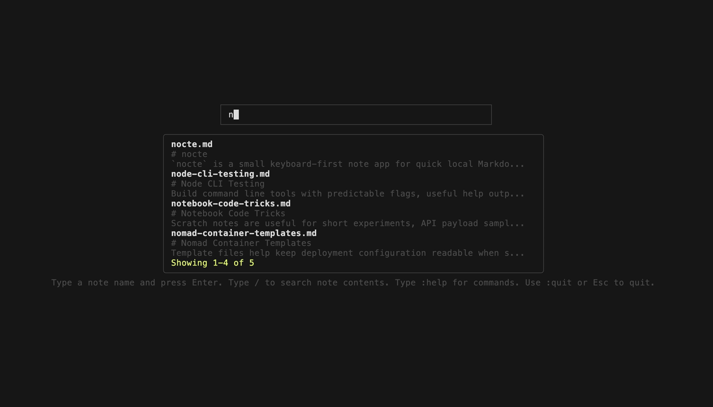

# nocte

`nocte` is a small keyboard-first terminal note app that stores notes as plain Markdown files on disk.



## Requirements

- Go
- `chafa` if you want Markdown image previews in the editor

## Install

- Run `make install` to build and install `nocte` to `~/.local/bin/nocte`
- Set a custom install location with `make install BINDIR=/your/bin/path`
- Make sure your install directory is on your `PATH`

For example, in `~/.zshrc`:

```sh
export PATH="$HOME/.local/bin:$PATH"
```

## Usage

### Launcher

- Type a note name to fuzzy-search existing notes
- Press `Up` or `Down` to move through note matches
- Press `Enter` on a selected match to open it
- Press `Enter` without selecting a match to create a new note

### Full-Text Search

- Type `/` followed by text to search inside your notes
- Press `Up` or `Down` to move through search matches
- Press `Enter` on a selected result to open the note at the matching line
- Pressing `Enter` without a selected search result does not create a new note

### Commands

- Type `:` to open the command palette
- Use `:list` to browse every note sorted by last update
- Use `:todo` to browse open Markdown tasks across notes
- Use `:export-all` to render all notes to HTML in the notes directory `html` folder
- Use `:files` to open the notes directory in the system file manager
- Use `:help` to see available commands

### Editor

- Edit notes in a plain text editor and save on exit when content changed
- Press `Ctrl+P` to toggle the live Markdown preview for headings, lists, task lists, links, inline code, bold, italics, and strikethrough
- Press `Ctrl+T` to toggle the current line between open and checked Markdown task states, or turn a non-task line into an open task
- Press `Ctrl+E` to render the current note to `html/<note>.html` under your notes directory and open it in your default browser
- Press `Ctrl+L` to browse links found in the current note and open the selected link in your default browser
- Press `Ctrl+D` to delete the current note after confirming and return to the launcher
- Press `Ctrl+H` to open the editor shortcut help dialog
- Brand-new untouched empty notes are discarded when you leave the editor

### Image Preview

- Add a Markdown image like `` to preview local images beside the editor when `chafa` is installed
- If `chafa` is not installed or an image cannot be rendered, the preview falls back to showing the image label and path

## Commands

- `:help` shows available commands
- `:export-all` renders all notes to HTML in the notes directory `html` folder
- `:info` shows version and path information
- `:list` shows all existing notes in a selectable dialog sorted by last update
- `:todo` shows open Markdown tasks across notes in a searchable results palette
- `:files` opens the notes directory in the system file manager
- `:quit` exits the app

## Paths

- Config: `~/.config/nocte/config.json`
- Default notes directory: `~/nocte`

The config file currently supports:

```json
{
  "notes_path": "~/nocte",
  "tab_width": 4
}
```
